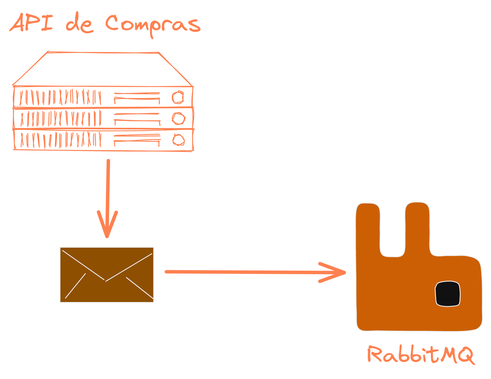

### Mensageria

{width=100%}

---

### O que vamos falar

- **Comunicações Síncronas e Assíncronas**
- **Filas**
- **Tópicos**
- **Boas práticas na integração dos sistemas**

---

### Sistema de E-Commerce

{width=60%}

---

### HTTP

---

### HTTP

---

### HTTP

---

### É muito mais complexo que isso

---

### E muitas veses precisamos fazer isso de forma assíncrona

- Não temos informação na hora
- Não temos poder computacional para processar tudo na mesma hora
- ...

---

### O que fazer nesses casos então?

---

### Mensageria nos ajuda nisso

---

### Principais conceitos - Producer

---

### Principais conceitos - Producer

---

### Principais conceitos - Message Broker

{width=60%}

---

### Principais conceitos - Consumer

{width=60%}

---

### Filas

{width=80%}

---

### Filas - Importante

A mensagem só pode ser lida por um consumidor!

---

### Tópicos

{width=90%}

---

### Tópicos - Como funciona

{width=100%}

---

### Exemplo com RabbitMQ

{width=80%}

---

### Exemplo com RabbitMQ

{width=80%}

---

### Exemplo com RabbitMQ

- Exemplo de velocidade de processamento
- Um evento chama o outro

---

### E se der problemas?

---

### Chave de idepotencia - Reprocessar

---

### Dúvidas?

{ width=90% }
