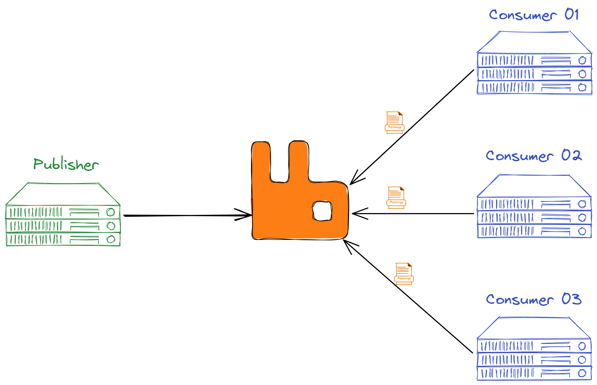

# Estudos RabbitMQ

---

## Resource Sharing

O Rabbit é um tipo de ferramenta que facilita o compartilhamento de recursos enrte aplicações, mas, diferente de um sistema de arquivos, um RPC ou um banco de dados, aqui temos alguns pontos interessantes.

- Escalabilidade
- Resiliência
- Confiabilidades

## Message Broker

Nessa ideia de message broker temos três atores, quem gera a mensagem(publisher), o message broker(mediador) e quem consome a mensagem(consumer). E o mais importante, ajuda a reduzir gargalos, se o consumidor estiver já lotado de mensagens e não consegue mais controlar nada, ele simplismente para de pedir mensagens, então acabamos tendo uma escala um pouco mais controlada, onde processamos o que a gente conseguir no tempo que conseguir. Importante! é o consumer que vai buscar essas mensagens e não o message broker que fica enviando.

Com message broker também facilitamos a escala, podemos ter quantos consumidores e geradores de mensagem quisermos.

