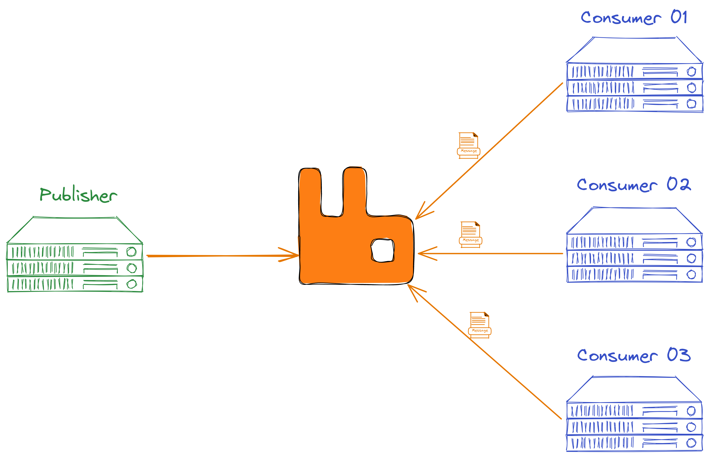
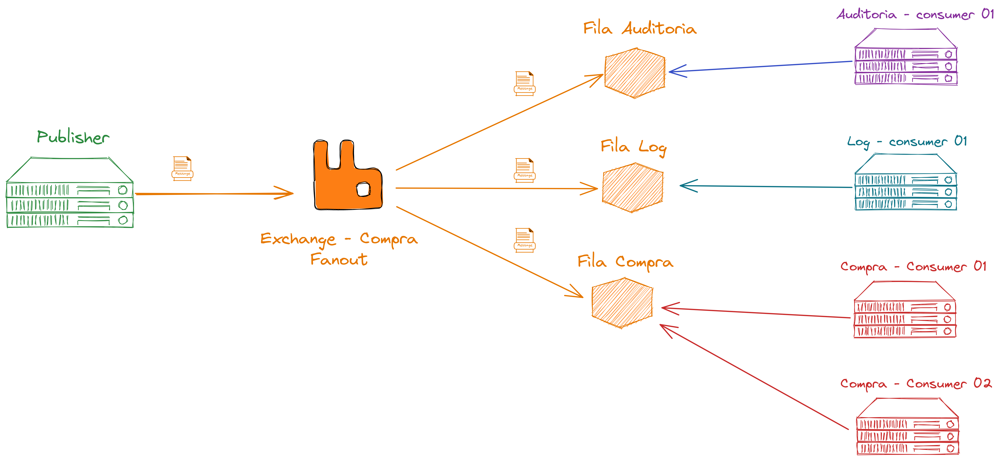

# Estudos RabbitMQ

---

## Exemplos

- [**Consumer de Log Node.js**](./src/consumer/log)
- [**Consumer de Register .NET Core**](./src/consumer/background-service)
- [**Publisher Asp Net Core**](./src/publisher/)

---

## Resource Sharing

O Rabbit é um tipo de ferramenta que facilita o compartilhamento de recursos enrte aplicações, mas, diferente de um sistema de arquivos, um RPC ou um banco de dados, aqui temos alguns pontos interessantes.

- Escalabilidade
- Resiliência
- Confiabilidades

## Message Broker

Nessa ideia de message broker temos três atores, quem gera a mensagem(publisher), o message broker(mediador) e quem consome a mensagem(consumer). E o mais importante, ajuda a reduzir gargalos, se o consumidor estiver já lotado de mensagens e não consegue mais controlar nada, ele simplismente para de pedir mensagens, então acabamos tendo uma escala um pouco mais controlada, onde processamos o que a gente conseguir no tempo que conseguir. Importante! é o consumer que vai buscar essas mensagens e não o message broker que fica enviando.

Com message broker também facilitamos a escala, podemos ter quantos consumidores e geradores de mensagem quisermos.

## Exchange

Pega uma mensagem e manda para diversas filas. Basicamente podemos ter vários consumers processamento a mesma mensagem.
Temos uma publicação da mensagem, o Rabbit pega essa mensagem e manda para uma ou mais filas, e temos workers específicos para tratar cada fila.
Exemplo fictício de uma ação de compra, com uma mensagem podemos ter um consumer de log, outro de auditoria e outro para efetuar a compra(nesse caso seria uma exchange Fanout).
Em resumo é um roteador de mensagem para uma ou mais filas, e na prática, você sempre passar por esse roteador.

### Tipos

- **Direct**: processo de configuração onde a gente fala que se a mensagem chegar na Exchange para qual fila ela deve ser enviada, isso tudo é processado com o uso de uma `Routing Key`

- **Fanout**: distribui a mensagem que chega e manda para todas as filas associadas ao exchange, seria o exemplo usado na imagem acima.

- **Topic**: Faz uso de padrões do `Routing Key` para redirecionar para as filas, ex.: `user.*`

- **Headers**: usa dados do cabeçalho para saber para onde mandar a mensagem, e aqui podemos fazer o match por `Regex`.

Obs: duas exchanges diferentes podem mandar mensagem para a mesma fila.

## Rabbit
